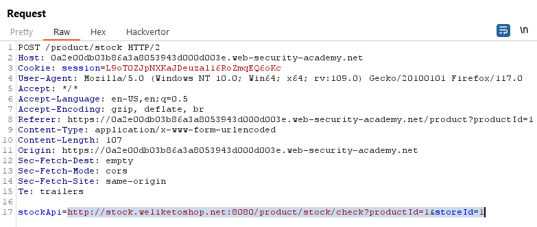

## [Lab 1: Basic SSRF against the local server](https://portswigger.net/web-security/ssrf/lab-basic-ssrf-against-localhost)

đây là main web của chúng ta

đầu tiên test chức năng `View details`, ta sẽ thấy có chức năng mới là `Check stock`

quan sát request coi sao

ta thấy nó sẽ  gọi đến 1 URL mới để lấy thông tin sản phẩm -> có URL ta nghĩ ngay đến lỗi SSRF

giờ ta sẽ gọi đến `/admin`

kết quả là thành công luôn

xem đường dẫn đến delete account

giờ thì delete `carlos` và solve lab

thử test bằng tool: chưa biết test

## [Lab 2: Basic SSRF against another back-end system](https://portswigger.net/web-security/ssrf/lab-basic-ssrf-against-backend-system)

vẫn lỗi như **lab 1** nhưng URL có chút khác, và yêu cầu của bài chỉ cần quét trong `192.168.0.X` với port `8080`

ta sẽ test 1 địa chỉ IP bất kỳ để xem response trả về như thế nào

-> lỗi 500 Error

giờ ta sẽ test xem URL nào là hợp lệ bằng cách sử dụng Intruder cho nhanh

1. Payload: `Number` `1 - 256`
2. có thể Grep Match với `carlos` hoặc chú ý `Status code`

result tìm được địa chỉ IP thỏa mãn là `192.168.0.122`

chú ý đường dẫn đến để delete `carlos`

delete and solve

## [Lab 3: SSRF with blacklist-based input filter](https://portswigger.net/web-security/ssrf/lab-ssrf-with-blacklist-filter)

vẫn lỗi như **lab 1, 2**

khi test các URL `127.0.0.1` hoặc `localhost` thì đều sẽ gặp lỗi 400 vì đã bị block

bypass bằng 1 số cách như `127.1` thì vẫn bị lỗi 400 như trên, obfuscate ký tự `a` bằng doubleUrl encode, `%61` là `a`, `%25` là `%`

## [Lab 5: SSRF with filter bypass via open redirection vulnerability](https://portswigger.net/web-security/ssrf/lab-ssrf-filter-bypass-via-open-redirection)

khác những lab trên, lab này có thêm chức năng `Next product` sẽ redirect sang trang khác được đề cập trong `path`

quan sát request thấy có `path` và status code khi send request là `302` là redirect

đổi thành URL coi sao nhé

follow redirection, đã chuyển ta đến sang host google thành công

--> ta sẽ dùng nó để redirect tới địa chỉ mà chúng ta cần đó là `http://192.168.0.12:8080/admin`

vẫn như các lab trên thì vẫn sẽ là lỗi ở `checkStock`, tuy nhiên ở đây lại dùng `path` thay vì URL như các lab trên

thay nó thành URL xem có gì xảy ra không, lỗi `400` và `Invalid URL`

giờ ta sẽ thay nó thành endpoint chứa `path` ở phần `Next product` trên

and the response trả về đúng sản phẩm có `id=2` và ta phát hiện còn có thêm `Admin panel`

change path thành địa chỉ đề cung cấp để thực hiện yêu cầu

delete and solve the lab

## [Lab 6: Blind SSRF with out-of-band detection](https://portswigger.net/web-security/ssrf/blind/lab-out-of-band-detection)

mục đích của lab này đơn giản chỉ là tạo yêu cầu request HTTP tới máy chủ Burp Collaborator

Poll now để xem thành công chưa

solve the lab

